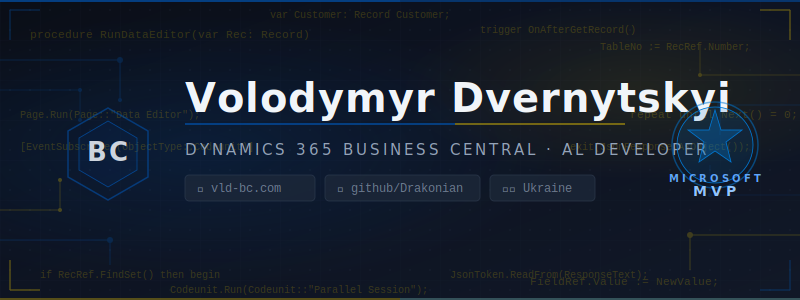

  

  

---

### About Me

- 🇺🇦 From Ukraine, Zhytomyr
- 💼 Microsoft MVP — Dynamics 365 Business Central & AL Developer
- 📚 I blog about BC development at [vld-bc.com](https://vld-bc.com/)
- 🛠️ Building open-source tools for the Business Central community

---

### Latest Blog Posts

<!-- BLOG-POST-LIST:START -->
- [CLI Agents Part 3: Business Central MCP Server](https://vld-bc.com/blog/cli-agents-part3-business-central-mcp-server)
- [CLI Agents Part 2: Claude Code Best Practices](https://vld-bc.com/blog/cli-agents-part2-claude-code-best-practices)
- [SharePoint Graph API for Business Central](https://vld-bc.com/blog/sharepoint-graph-api-for-business-central)
- [How to support open-source](https://vld-bc.com/blog/how-to-support-open-source)
- [CLI Agents: The New Standard of AI Coding](https://vld-bc.com/blog/cli-agents-new-standard-ai-coding)
<!-- BLOG-POST-LIST:END -->

---

### Tech Stack

  
   
  

  
  
  

---

### GitHub Stats

  

[blog]: https://vld-bc.com/
[linkedin]: https://www.linkedin.com/in/drakonian/
